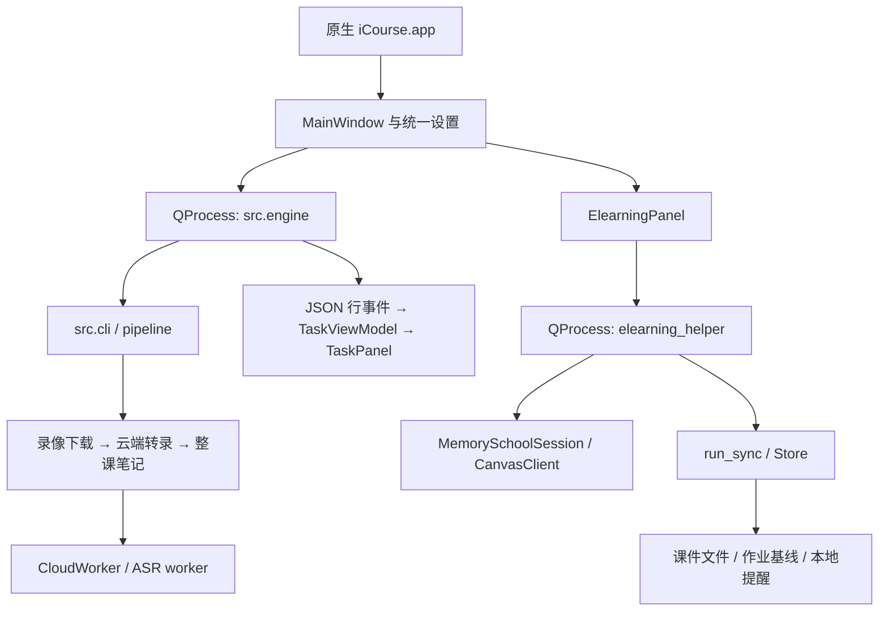

# 开发、测试与发布

本文对应 2026-10-06 源码，包版本为 `0.7.1`。用户操作见[使用说明](usage.md)，此前设计评价及风险见[架构评审](architecture.md)。

## 开发环境

桌面基线：Apple Silicon、macOS 14+、Python 3.13、uv、ffmpeg/ffprobe、Command Line Tools。源码支持的 Python 范围见 `pyproject.toml`；其他平台的核心测试不能代替 Mac 桌面验收。

```sh
uv sync --locked --extra mac --python 3.13 --managed-python
QT_QPA_PLATFORM=offscreen PYTHONDONTWRITEBYTECODE=1 .venv/bin/python -m pytest tests -q
.venv/bin/ruff check --select F src tools scripts main.py tests
.venv/bin/python -m src.cli doctor
```

测试使用临时目录、虚构账号、模拟响应和回环 HTTP 服务器；运行环境需允许绑定 `127.0.0.1`。不得把真实密码、钥匙串读取、学校同步、付费模型调用或邮件发送混入自动化回归。GUI 测试显式传入默认或模拟设置。

## 模块与入口

| 模块 | 实际职责 |
|---|---|
| `src/mac_gui.py`、`settings_panel.py`、`preferences.py` | 三页主窗口、统一表单、原子保存和两个独立子进程；不是下载服务 |
| `src/workspace_paths.py` | 并行启动前检查课程输出范围是否重叠 |
| `src/cli.py`、`engine.py` | 命令分派；引擎管理结构化输出、心跳、唤醒与取消 |
| `src/pipeline.py` | 回放规划、复用判定、下载/转录/笔记三个阶段的串接 |
| `src/pipeline_state.py` | SQLite 阶段队列、失败/中断状态、产物有效性检查 |
| `src/icourse.py`、`webvpn.py`、`fudan_idp.py` | iCourse 接口、WebVPN 路由与可复用的复旦 IDP 协议 |
| `src/video_download.py` | 录像范围请求、可靠标识、断点与媒体完成检查 |
| `src/video_storage.py` | 外置直写的刷盘、分段回读比较、小型系统盘接收摘要与存储异常 |
| `src/transcriber.py`、`media.py` | 音频提取、分块、块缓存、时间轴及字幕 |
| `src/asr/client.py`、`worker.py`、`cloud.py`、`dashscope.py` | 可取消网络子进程、兼容音频接口及百炼异步任务协议 |
| `src/summarizer.py` | 完整原文一次笔记请求、有限重试、结果完整性与响应缓存 |
| `src/artifacts.py`、`summary_storage.py` | 原子文件写入、哈希缓存、隐藏历史与正式笔记提交 |
| `src/task_events.py`、`task_view_model.py`、`task_panel.py` | 版本化进度事件、按课程/课次聚合、诊断与最近结果 |
| `src/elearning_panel.py` | eLearning 子进程、作业筛选、学校入口和同步计数 |
| `src/elearning_settings.py` | 保存目录、课程映射的编辑、校验、导入与个人配置保存 |
| `src/elearning_helper/config.py`、`api.py`、`auth.py` | 映射和边界验证、分页 GET、独立内存 CAS 会话 |
| `src/elearning_helper/sync.py`、`state.py`、`__main__.py` | 文件策略、作业变化、SQLite 基线/提醒、运行锁与 CLI |
| `scripts/install_mac_runtime.py`、`create_mac_app.py`、`macos_launcher.m` | wheel 检查、独立运行环境、原生 App 构建 |
| `src/mac_app_check.py` | 默认设置下的原生启动自检与离线 eLearning 演示 |
| `main.py`、`src/database.py`、`src/emailer.py` | 旧订阅/数据库/邮件入口，标准桌面操作不经过此链路 |
| `tools/` | 兼容代码与辅助接口；仍有调用者，不能整目录当作无用代码删除 |

`icourse` 对应 `src.cli:main`，`icourse-mac` 对应 `src.mac_gui:main`。`启动 iCourse.command` 打开安装版。`启动 eLearning.command`、`python -m src.elearning_panel` 和 `python -m src.mac_gui --elearning` 仅为独立界面测试入口，没有主窗口的凭据提供器，不能作为正式登录入口。

## 调用与进程边界



录像每阶段一个工作线程，阶段之间可以重叠；网络 ASR 在独立子进程中执行。录像引擎创建受管进程组，停止先发送 SIGTERM，GUI 约 2.5 秒后清理仍存在的进程组。eLearning 停止向自己的单个 worker 发送 SIGINT，约 2 秒后强制结束仍在运行的进程。同一主窗口允许两组任务并行，停止和完成回调各自更新本模块；关闭同时取消两组。跨进程另有各自的锁。停止客户端不等于撤销已经提交的云端付费任务。

录像 stdout 使用版本 1 的 JSON 行，含 `run_id`、锁保护递增的 `seq` 及 `(course_id, sub_id)`；普通输出进 stderr。模型忽略旧运行、重复序号和结束后的进度。`--target COURSE:LECTURE` 可重复，`--resume-stage COURSE:LECTURE:dl|tr|sm` 只作用于显式目标。最近运行摘要仅供展示，不负责恢复队列。

eLearning stdout 目前是结束时的一份 JSON，stderr 是运行诊断；GUI 缓冲整份结果并调用 CLI 的 `display()` 生成详情。它尚未采用录像的事件模型，这是已知维护边界，见架构评审。

## 凭据与登录边界

| 路径 | 当前机制与限制 |
|---|---|
| 设置保存 | 普通设置与四项凭据写入同一个明文 `settings.json`，原子替换；正常读写不访问 Keychain，旧格式仅迁移时读取一次 |
| GUI → 录像引擎 | `runtime_environment()` 将启动时已保存配置中的 UIS/API 凭据放入子进程环境；不作为命令行参数 |
| 引擎 → ASR worker | 请求与设置通过 stdin JSON；`Popen` 仍继承父进程环境，不能声称环境中绝无凭据 |
| GUI → eLearning worker | 只提交启动时已保存的学号和密码，通过私有 stdin（最多 8192 字节）；不额外放入 argv、环境、文件或日志 |
| eLearning 认证 | 新建内存会话，独立完成 CAS 回调及用户 profile 校验；不读取浏览器 Cookie，也不额外读取 Keychain |
| eLearning CLI 兼容模式 | 可读取配置指定的 Bearer 环境变量；GUI 使用账号密码管道，不要求创建 token |

共享 `fudan_idp.py` 只复用认证协议。iCourse 的 WebVPN 会话与 eLearning 会话分开，服务回调及成功校验各自保留。eLearning 下载到允许的存储主机时不携带学校 Cookie/认证头。验证码、二次认证及未知跳转停止，不自动解答挑战。主窗口从本地设置加载已保存的凭据；测试用模拟设置，真实凭据迁移与自动化回归分开执行。

## 状态、缓存与一致性

| 数据 | 所有者与恢复含义 |
|---|---|
| `settings.json` | schema 3：两组任务配置、嵌套 `elearning` 和明文密码/API Key，统一原子替换；不要作为诊断附件共享 |
| 旧 `elearning.json` | 缺少统一 eLearning 配置时的导入来源，保存后统一文件优先；旧文件保留 |
| 临时 `icourse-elearning-run-*/config.json` | 启动时的非秘密 eLearning 配置副本，worker 只读此副本，正常结束/启动失败后清理 |
| `Fudan iCourse/pipeline.sqlite3`、`pipeline.lock` | 录像阶段状态与单流水线锁；新运行依据产物重新规划，旧 queued/running 标记中断 |
| 产物旁 `.icourse/` | 校验记录、录像续传、完整笔记响应和旧笔记历史；普通已完成笔记允许用户编辑 |
| `Fudan iCourse Subscriber/asr-cache/` | 按来源与语音配置隔离的成功块、云端任务编号和恢复资料 |
| `Fudan iCourse/eLearning/index.sqlite3`、`run.lock` | 文件来源/散列/路径，课程检查时间、作业基线、本地提醒与同步互斥 |
| `tasks.log`、`last-run.txt` | 录像诊断及上次展示摘要，不是执行状态来源 |

具体绝对位置见[安装指南](mac-install.md#文件安装在哪里)。不要混用旧 `main.py` 的数据库与当前两套索引。

录像队列使用 WAL；eLearning 文件记录逐文件提交，作业每课完整读完分页才更新基线。同名保留在查询旧索引和计算 SHA 之前返回，不写新的已验证行，也不推进旧行的来源版本。新文件先原子发布，再提交 SQLite：两者不是一个事务；若在两步之间崩溃，下次按同名规则保留未索引文件，不虚构校验结果。

当前两个 SQLite 核心没有统一的版本迁移机制，JSON 缓存各有自己的 schema。后续改结构必须新增迁移/兼容测试；不能用删除用户数据库替代迁移。正常取消清理本次临时文件，强杀可能留下 `.elearning-*.part`；它不会作为课件复用。

## 关键行为约束与测试位置

| 约束 | 主要回归测试 |
|---|---|
| 同名保留、零传输、不写假索引、并发出现同名文件 | `test_same_name_preservation.py`、`test_courseware_dedup.py` |
| 所有类型、严格小于 50,000,000 字节、旧目录不查重 | `test_elearning_all_files.py`、`test_elearning.py` |
| 短读从头最多三次、1/2 秒退避、认证与策略错误不重试 | `test_download_recovery.py`、`test_download_diagnostics.py` |
| 作业分页完整、锁定项隐藏、解锁重现与基线不丢失 | `test_assignment_visibility.py`、`test_elearning_panel.py` |
| CAS、跨域、模拟凭据、主窗口手动触发与不额外保存 | `test_elearning_auth.py`、`test_elearning_panel.py` |
| 录像续传、媒体完整性、阶段恢复与课程身份 | `test_video_download.py`、`test_media_integrity.py`、`test_pipeline_roundtrip.py` |
| 云端两种协议、取消、缓存、时间戳 | `test_cloud_asr.py`、`test_dashscope_asr.py`、`test_asr_media.py` |
| 整课单次请求、截断拒绝、笔记历史与失败恢复 | `test_single_pass_summary.py`、`test_empty_summary_response.py`、`test_summary_storage.py` |
| 事件乱序/旧运行、GUI、本地凭据原子保存与旧钥匙串迁移、安装边界 | `test_task_events.py`、`test_task_panel.py`、`test_settings_summary.py`、`test_mac_installer.py` |

新语音模型只要使用现有协议与结果格式，可配置完整模型 ID；新协议应新增适配器及 HTTP 合约、取消、恢复测试。不要按模型名猜测时间戳能力或生成虚假字幕。录像大文件续传和 eLearning 小文件完整重试有不同保留语义，不应直接合并为同一下载实现。

## 构建、安装与发布

```sh
uv build --wheel --out-dir build/wheels
.venv/bin/python -c 'from pathlib import Path; from scripts.install_mac_runtime import validate_wheel; [validate_wheel(p) for p in Path("build/wheels").glob("*.whl")]'
```

wheel 白名单为 `src/`、`tools/` 的 Python 文件、规定的包元数据，以及唯一例外 `src/elearning_helper/config.json`。GitHub 副本使用通用课程示例；若本地修改了内置配置，公开同步前须替换个人路径和课程映射。白名单检查不等于已经检查了内容，仍需审计源码包，不能打包整个工作目录。

使用临时目录验证安装，仍需关闭正在使用相同源码构建产物的任务：

```sh
validation_dir="$(mktemp -d)"
ICOURSE_STATE_DIR="$validation_dir/state" .venv/bin/python scripts/install_mac_runtime.py \
  --support-dir "$validation_dir/support" --applications-dir "$validation_dir/Applications"
"$validation_dir/support/runtime/bin/python" -I -m src.cli doctor
QT_QPA_PLATFORM=offscreen "$validation_dir/Applications/iCourse.app/Contents/MacOS/iCourse" --self-test
codesign --verify --deep --strict "$validation_dir/Applications/iCourse.app"
```

验收结束后关闭该验证 App，清理本次创建的 `validation_dir`，避免遗留完整运行环境和可被 Spotlight 找到的旧入口。不要删除正式运行环境、共享 Python 或用户数据。安装目录及空间边界见[安装文档](mac-install.md#安装结构与空间管理)。

原生入口加载安装运行环境的 Python，使用 `-I` 隔离搜索路径，保留正确的 `sys.executable` 供子进程使用。自检使用空白默认设置，实际建立 Qt 主窗口并跑离线 eLearning 演示，不读取用户设置或 Keychain，也不登录。它不能证明 Finder 启动后的真实 TCC 授权和线上服务可用。

安装器先构建、审计 wheel 和编译启动器，再原地更新 runtime；CLI 入口只持有 `pipeline.lock`，没有覆盖原生 App 是否仍打开或 eLearning 的 `run.lock`。因此正式更新必须人工结束两类任务并退出 App。本次安装另行检查了 App 进程和两类锁，但该保护尚未内建于仓库安装器。不可把它描述为现有安装器的全局互斥保证。

发布流程：

1. 审核改动和测试；在 Git 工作副本中先获取远端状态并确认目标分支。没有 `.git` 的开发副本只按源码白名单同步到受版本控制的副本，再检查差异；不得把缓存和个人文件整目录复制过去。
2. 在干净环境跑回归、F 类 lint、wheel 审计、临时安装、自检和签名检查。
3. 同步 `pyproject.toml`、`uv.lock`、CHANGELOG；当前版本为 0.7.1，提交 SHA 用于追踪这次源码快照。
4. 检查 sdist/源码 ZIP，排除凭据、个人设置、日志、数据库、课程和虚拟环境；处理默认课程配置中的个人路径。
5. 在最低支持 Mac 上手工验证启动、目录授权、保存/恢复及用户主动的小范围真实任务。按授权推送目标分支；推送源码不等于创建版本标签、GitHub Release 或分发便携 App。

CI 配置矩阵为 macOS 14、macOS 26、Ubuntu 24.04，执行核心测试、lint、wheel 审计及 Mac 临时安装。桌面检查按两种任务模式验收。工作流无定时订阅；远端结果以相应提交的 GitHub Actions 状态为准，本机测试通过不能替代远端结果。用户要求仅跳过某次自动检查时，可在该次提交信息加入 `[skip ci]`；这不会删除工作流或将旧失败记录改成通过。0.7.1 本次推送按用户要求跳过远端检查，验收依据为本地测试和安装检查。

## 历史验证：2026-10-04

2026-10-04，同名保留修订新增专门测试并更新相关回归；最终完整测试 **480 passed in 39.60s**。此前同修订针对性测试 169 项通过。最终 F 类静态检查通过；移除了四个 eLearning 测试文件中九个未使用导入，再次完整回归通过。源码、测试与用于完整回归的工作副本按文件散列核对一致；安装版四个相关模块与源码匹配，原生 App 离线自检及签名验证通过。

本次未读取真实密码、Keychain、浏览器 Cookie，未登录学校或调用付费接口。用户此前的真实学校登录、多类型同步和 Azure 文件恢复属于独立的用户实机反馈；它们不证明本次所有新分支均在线上验收。架构建议也未伪装成已实施功能。

## 2026-10-05：录像快速规划

新增 `src/video_checks.py`：在线常规规划的复用判定只读取有界 sidecar、文件 stat、既有下载失败记录；不调用 hash、ffprobe 或 MP4 扫描。按课程目录与完整课次 ID 限定候选，排除隐藏断点、符号链接、零大小文件和歧义。在线规划不再迁移旧录像/笔记文件。`unchecked` 是终态，对应 `skipped`，与成功分开计数；正常旧视频不自动进入付费阶段。

手动 `verify-videos` 不经过学校登录或 ASR/LLM 设置，持有同一个 `pipeline.lock`，全量 SHA-256（不命中旧哈希缓存）+媒体 probe，逐字节进度节流到每250ms；取消沿用 engine 进程组取消。验证结果保存在 `ICOURSE_STATE_DIR/video-checks/<path-hash>.json`，默认系统盘 Application Support/Fudan iCourse。失败一直保留，直到针对同一路径的完整验证或经既有完整性验证的新下载成功。验证取消不写成功/失败。通过记录仅在文件签名未变且没有更新的异常标记时有效；原 sidecar 保留。

`tests/test_filename_reuse.py` 覆盖无内容读取、课程/课次身份、空文件、符号链接、异常 sidecar/历史失败、部分下载保留、重复运行、无付费调用、真实 ffprobe、手动进度和取消。流水线 roundtrip 更新了旧文件“未校验跳过”的 UI 语义。明确本地生成/重做模式继续使用原来的严格来源验证；新下载媒体检查保持不变。没有实现卷 UUID 缓存重构、提高下载并发或更改 eLearning。


## 2026-10-06：两种桌面任务与 eLearning 配置

桌面仅保留 `download_and_summarize` 和 `download`，旧 `overwrite` / `redo_notes` 设置在收集表单时清除；高级 CLI 模式继续兼容。完整模式按缺项处理，已下载录像不再直接跳过整课。现有笔记通过本身的完成/散列规则保留，不因旧来源路径失效重做；需要复用转录时用当前录像的内容摘要核对来源。缺录像但已有笔记时仅下载，缺录像但已有转录时下载后验证转录来源再决定是否调用 ASR。已知录像异常继续在付费阶段前阻止。

`elearning_settings.py` 提供配置编辑窗口；`config.parse_config()` 在写入前校验内存数据，原子保存到安装目录之外的个人配置。不读写凭据，不自动登录或同步。导入时将相对状态目录正规化为原配置对应的绝对位置，避免导入后悄悄改用空白索引。运行中禁用配置修改。

新增回归覆盖两种任务与录像/转录/笔记存在性的组合、迁移后的来源摘要匹配、旧重做标志清除、eLearning 保存恢复、导入、取消和错误配置不覆盖。测试使用模拟学校与模型服务，不调用真实收费接口。

本修订完整离线回归：**562 passed in 40.25s**；F 类静态检查通过，新增界面已离线渲染检查。构建 wheel 已白名单审计；正式本机更新前检查 App/后台进程并同时持有录像与 eLearning 任务锁，保存原安装备份。学校及收费服务未在本次修改中调用。

## 2026-10-06：本地凭据与空间整理

0.6.10 将普通设置和四项凭据写入同一个 `settings.json`，不增加权限选项、加密密码或单独的密钥文件。旧版 Keychain profile 仅用于一次迁移：读取成功后原子保存文件；后续启动、保存不再访问 Keychain，原条目保留。原子替换失败时旧文件仍可读取。凭据文件不进入 Git、wheel、源码包或公开诊断。

完整离线回归 **564 passed in 40.55s**，覆盖文件保存/恢复、不访问钥匙串、旧数据迁移、迁移失败与写入失败。F 类检查、wheel 审计、正式 App 自检及签名验证通过。真实凭据迁移在本机单独完成，没有把值写入日志或调用学校、付费服务。

按用户要求清理开发机的三套旧环境、十个旧启动器和已不再需要的中转目录。清理目标目录统计合计约 12.66 GB，前后观测系统可用空间增加约 7.52 GB；共享数据块、快照和同时运行的任务会影响差值，不能将目录大小相加当作必然释放量。正式 App、当前开发环境、课程目录及配置保留，正在运行的课程任务未中断，清理后正式 App 自检和签名检查通过。此为一次本机维护记录，不是安装器的自动清理行为。

## 2026-10-06：GitHub 源码同步验证

公开副本使用通用 eLearning 课程示例，测试通过独立模拟映射验证课程目录关系，不依赖开发者课表。该副本完整离线回归 **564 passed in 40.18s**，F 类静态检查、文档相对链接、待提交内容与本机凭据比对检查通过。源码包已检查排除个人配置和生成文件，wheel 已通过白名单审计；独立临时安装确认 0.6.10、两种任务模式和示例配置均可加载，原生自检与签名检查通过。临时 App、运行环境及构建副本在验收后清理，未改动正在使用的正式安装。


## 2026-10-06：统一设置与并行工作页（0.7.0）

主窗口拆为录像与笔记、eLearning 与作业、设置。`SettingsPanel` 管理草稿；只有校验和原子保存均成功后，`MainWindow.values` 才更新。录像引擎使用启动时的深拷贝与进程环境，eLearning 使用非秘密临时配置及一次性凭据管道。工作页显示本次配置，结束后切回下次配置；未保存修改不用于新任务。

两组 QProcess 的运行、停止、失败与退出互不联动。关闭窗口同时取消两边；录像启动前立即取消时等待实际 PID 后再停止，避免发信号给进程组 0。eLearning 正常退出和启动失败均清理本次配置副本。启动另一组同步前检查保存范围，允许同一课程根目录的独立课件子目录。

完整离线回归 **580 passed in 61.32s**，其中新增 16 项涵盖两个启动顺序、两个停止顺序、同时运行时保存设置、账号和路径快照、独立完成/启动失败、立即关闭、导入草稿、旧配置兼容、保存失败与路径冲突。F 类检查通过，七个界面页/分组完成离线显示检查。测试使用虚构账号和本机进程，未登录学校或调用付费服务。

正式本机更新已在 App 退出、同时持有两类任务锁时完成。wheel 白名单审计、0.7.0 原生 App 离线自检、签名及安装源码逐文件核对通过；原设置值保留，原 eLearning 五门课程映射纳入统一文件。保存后重开检查不访问钥匙串，不启动学校任务。原地更新既有 runtime，没有新增运行环境；构建临时目录已自动清理，只保留小型源码及启动器 ZIP 回退资料。


## 2026-10-06：界面整理（0.7.1）

增加 `ui_style.py`，提供随系统外观切换的深浅主题、路径省略展示、统一控件与空闲引导。主窗口收紧标题、导航和任务摘要；相同录像/笔记目录合并展示，完整路径可悬停查看。进度仍在任务开始后显示，低频诊断入口集中在更多操作。eLearning 的空闲和无筛选结果状态使用引导，实际作业读取和筛选规则保持不变。

深色/浅色、设置分组、运行进度及 860×620 窗口完成离线渲染检查，修正空闲提示裁切和小窗口多余滚动。完整离线回归 **580 passed in 62.23s**，F 类检查通过。0.7.1 wheel 白名单审计、原生启动自检和安装源码核对通过，原地更新既有运行环境，设置文件逐字节保持不变；未发起学校或付费任务。


## 2026-10-06：0.7.1 GitHub 同步

本次同步 0.7.0–0.7.1 的统一设置、双工作页和界面整理，以及对应使用/安装文档。公开副本完整离线回归 **580 passed in 62.54s**，F 类检查、文档链接、wheel 白名单审计和源码包检查通过；公开课程配置保持通用示例，已核对未包含本机凭据及个人绝对路径。

此前 `219a816` 对应的 [GitHub Actions 检查](https://github.com/yihann-wang/Fudan_iCourse_Subscriber/actions/runs/37436999485) 以失败结束。本次按用户要求在提交中使用 `[skip ci]`，不触发远端自动检查，不改动工作流及历史记录，也不将跳过视作已修复旧检查失败。
